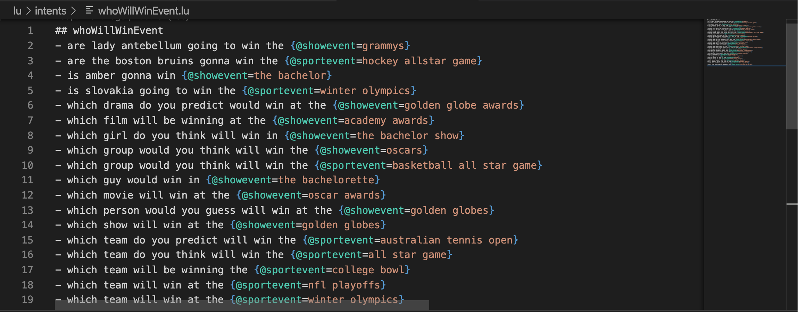

# ludown-extension

The ludown extension for vscode provides support for ludown (.lu) model definition files. ludown files is a markdown-like syntax to define intents and entities.

## Features

Syntax highlighting, intellisense, annotation snippet, sample generation.

## Requirements

## Extension Settings

## Known Issues

## Release Notes

Early, working prototype phase...

### 0.0.1

Loads intellisense entities from the ludown extension config module (ludown-extension-config.js)
- see an example in `docs/ludown-extension-config.js`
- manually configurable (for now)
- this file must be in the root of the current ludown project
- ctrl-alt-cmd-r reloads model

Generates samples by expanding the selected sample
- ctrl-alt-cmd-x expands the selected sample (not working yet)

Syntax highlighting, intellisense + annotation snippet.